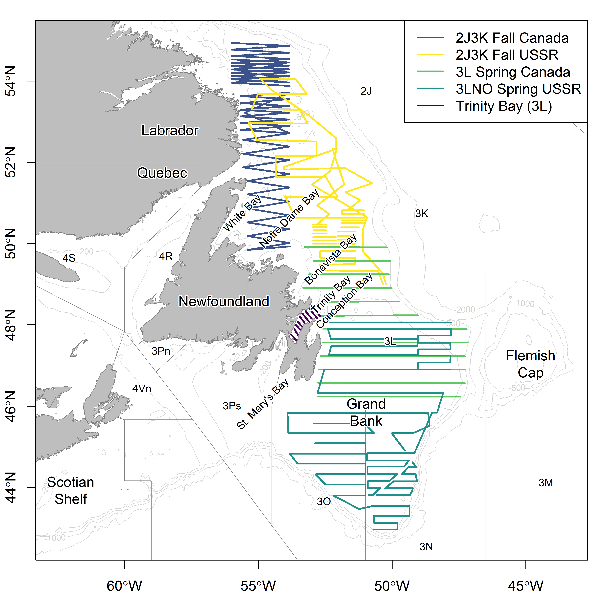
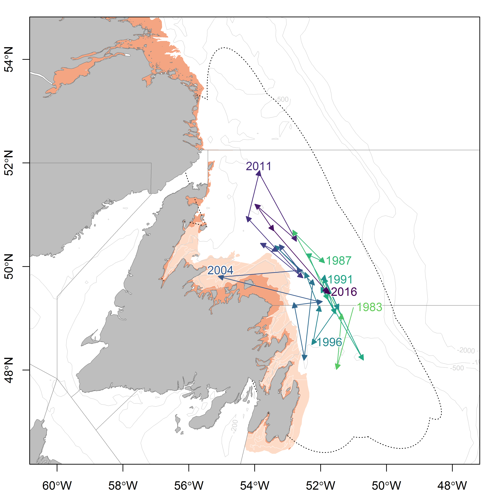

Capelin stock area in NAFO Divisions 2J3KL including embayments and major submarine banks surrounding Newfoundland, Canada. Included are the acoustic survey tracks conducted in Div. 3L (offshore) and Trinity Bay (inshore) in May 2018 by Canada (DFO, unpublished data); Div. 3LNO in June 1991 by the former USSR (see Bakanev 1992 for more details); Div. 2J3K in October 1983 by Canada (see Miller and Carscadden 1983 for more details); and Div. 2J3K in November 1991 by the former USSR (see Bakanev 1992 for more details).

Distribution of the center of gravity of capelin computed from the fall bottom-trawl survey in NAFO Divisions 2J3KL from 1983 to 2017. Annual center of gravity estimates are connected by lines through time, and composite elipises of deviation around these estimates (i.e. inertia) are indicated by the dotted black line. Center of gravity and inertia were calculated using equations found in Woillez et al. (2007). The red area indicates areas not covered by the survey and the light pink (cream) area indicates inshore strata that are poorly covered by the fall bottom-trawl survey.
